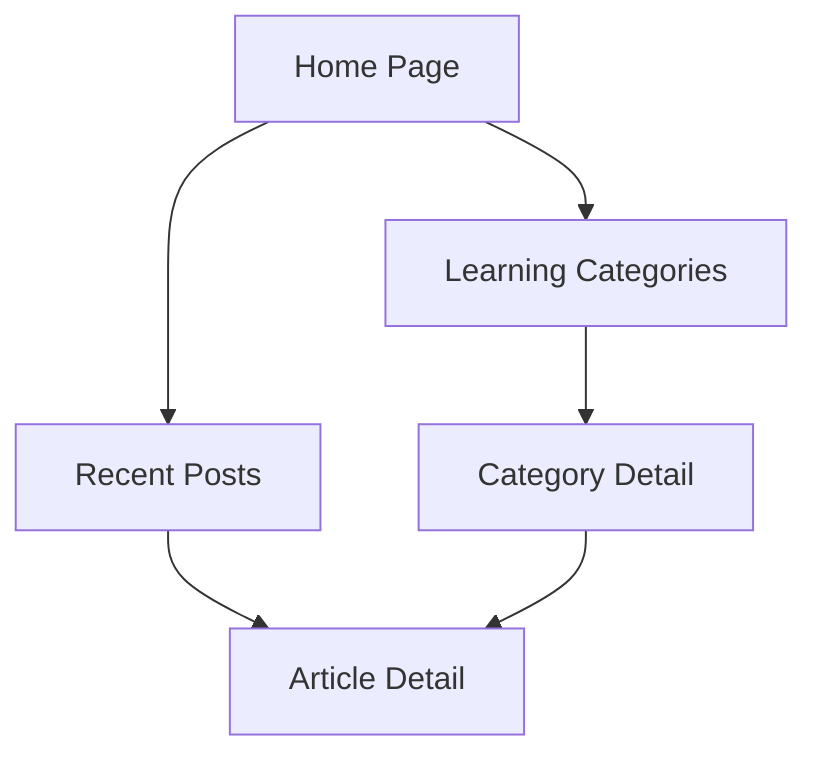

## 1. Product Overview
个人学习网页，用于记录学习过程和知识总结
- 为用户提供一个简洁、美观的平台，用于记录和展示个人学习内容
- 目标用户为学生、开发者和终身学习者，帮助他们组织和分享学习成果

## 2. Core Features

### 2.1 User Roles
| Role | Registration Method | Core Permissions |
|------|---------------------|------------------|
| Visitor | No registration required | Browse all content |
| Owner | Local development | Edit and add content |

### 2.2 Feature Module
1. **Home page**: hero section, navigation, learning categories, recent posts
2. **Learning categories page**: categorized content, filtering options
3. **Article detail page**: content display, code snippets, related articles

### 2.3 Page Details
| Page Name | Module Name | Feature description |
|-----------|-------------|---------------------|
| Home page | Hero section | Dynamic background, welcome message, quick navigation |
| Home page | Learning categories | Visual cards for different subject areas, click to explore |
| Home page | Recent posts | Timeline of recent learning activities and updates |
| Learning categories page | Category list | Filterable list of learning topics with icons |
| Learning categories page | Content preview | Brief descriptions and tags for each category |
| Article detail page | Content display | Rich text formatting, code highlighting, images |
| Article detail page | Related articles | Suggestions based on current topic |

## 3. Core Process
Users can browse the home page to get an overview of learning categories and recent activities. They can then navigate to specific categories to explore related content, or view detailed articles for in-depth information.

## 4. User Interface Design
### 4.1 Design Style
- Primary colors: #3b82f6 (blue), #10b981 (green)
- Secondary colors: #f59e0b (orange), #8b5cf6 (purple)
- Button style: rounded corners, subtle shadows, hover effects
- Font: Inter for body text, Playfair Display for headings
- Layout style: clean, minimalistic with ample white space
- Icon style: simple, line-based icons with consistent style

### 4.2 Page Design Overview
| Page Name | Module Name | UI Elements |
|-----------|-------------|-------------|
| Home page | Hero section | Gradient background, centered title, animated elements |
| Home page | Learning categories | Grid layout with card components, hover animations |
| Home page | Recent posts | Timeline view with date markers, subtle hover effects |
| Learning categories page | Category list | Sidebar navigation, responsive grid layout |
| Article detail page | Content display | Clean typography, code syntax highlighting, responsive images |

### 4.3 Responsiveness
- Desktop-first design with mobile-adaptive layout
- Breakpoints for mobile, tablet, and desktop views
- Touch optimization for mobile devices
- Responsive typography and spacing

### 4.4 3D Scene Guidance
Not applicable for this project