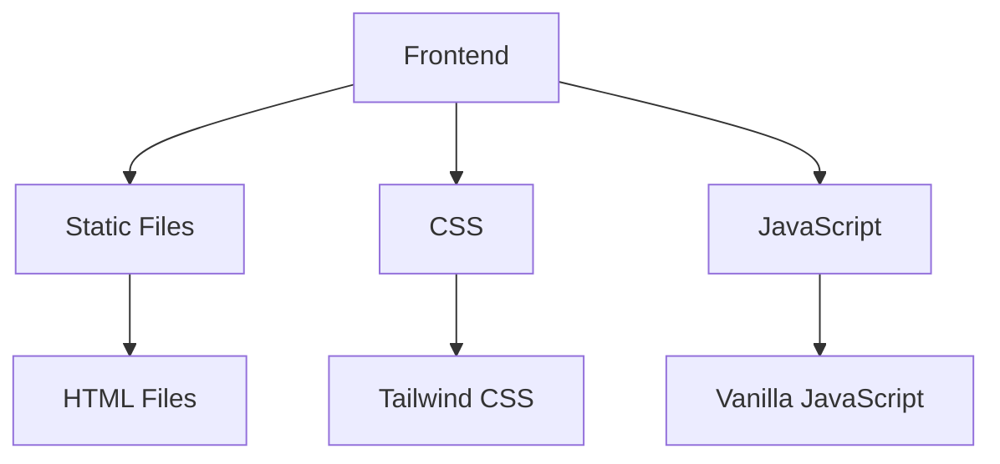

## 1. Architecture Design

## 2. Technology Description
- Frontend: HTML5 + CSS3 + JavaScript + Tailwind CSS
- Initialization Tool: None (static site)
- Backend: None (static site)
- Database: None (static content)

## 3. Route Definitions
| Route | Purpose |
|-------|---------|
| / | Home page with main content |
| /categories | Learning categories page |
| /articles/* | Article detail pages |

## 4. API Definitions
Not applicable for static site

## 5. Server Architecture Diagram
Not applicable for static site

## 6. Data Model
Not applicable for static site